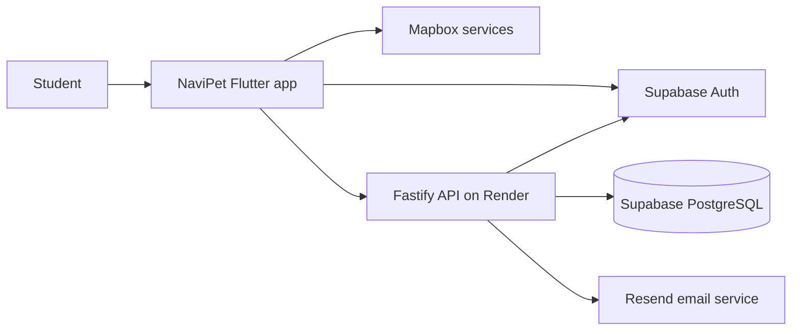

  

  # NaviPet

  **A student-built campus-navigation companion for California State University, Long Beach.**

  NaviPet combines walking navigation, class planning, task tracking, and a friendly virtual pet in one mobile experience.

  [Mobile app](https://github.com/navipet-senior-project/NaviPetFlutter) · [Backend API](https://github.com/navipet-senior-project/NavipetBackend)

## About the project

NaviPet is a CSULB senior project that helps students navigate campus and find their destinations without the usual confusion. The mobile app brings together location-aware navigation and everyday academic tools, while the backend supplies a secure foundation for authenticated data and future services.

The current project includes:

- Email/password authentication, password recovery, guest access, and persistent sessions
- A native Mapbox map with live device location
- Destination search, walking routes, ETA and distance previews
- Maneuver guidance, spoken instructions, arrival detection, and rerouting
- Class schedules, generated tasks, daily completion tracking, and account profiles
- Row Level Security for user-owned application data
- OpenAPI documentation and health checks for backend development

## Repositories

| Repository | Responsibility | Main technologies |
| --- | --- | --- |
| [**NaviPetFlutter**](https://github.com/navipet-senior-project/NaviPetFlutter) | Cross-platform NaviPet mobile application for Android and iOS | Flutter, Dart, Mapbox, Supabase |
| [**NavipetBackend**](https://github.com/navipet-senior-project/NavipetBackend) | API, authentication boundary, application services, email delivery, and database schema | TypeScript, Fastify, Render, Supabase, PostgreSQL, Resend |

## Architecture

The Flutter application owns the user experience and on-device navigation flow. Supabase Auth manages identity. The Fastify service runs on Render, validates access tokens, and provides a trusted server boundary for application rules and protected data access. PostgreSQL policies keep profiles, classes, and task progress scoped to their owners. Resend handles transactional email delivery.

## Technology

## Start developing

- Follow the [mobile setup guide](https://github.com/navipet-senior-project/NaviPetFlutter#prerequisites) to configure Flutter, Mapbox, and Supabase.
- Follow the [backend setup guide](https://github.com/navipet-senior-project/NavipetBackend#local-api-testing-with-swagger-ui) to run the API and Swagger UI locally.
- Review each repository's environment example before starting. Never commit API secrets or a Supabase service-role key.

## Senior project team

NaviPet is developed as a California State University, Long Beach senior project by:

| Team member | Role |
| --- | --- |
| [Khoi Do (@Ben2104)](https://github.com/Ben2104) | Full Stack Lead Developer / Project Manager |
| [Jomar Hernandez (@thejomar)](https://github.com/thejomar) | UI/UX Designer / Mobile Developer / Frontend Developer |
| [Will Chhuor (@will-chhuor)](https://github.com/will-chhuor) | Mobile Developer |
| [Jake Nomoto (@GlazedKrispy)](https://github.com/GlazedKrispy) | Backend Developer |
| [Jan Montemayor (@Kura-Yami)](https://github.com/Kura-Yami) | Full Stack Developer |

Project work, decisions, and progress are documented in the two public repositories above.

---

  Built at CSULB to help students navigate campus and their day.

